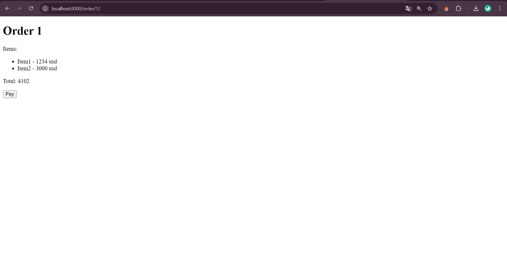
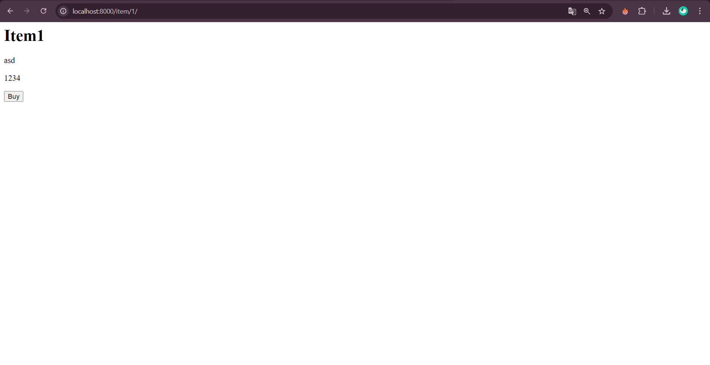
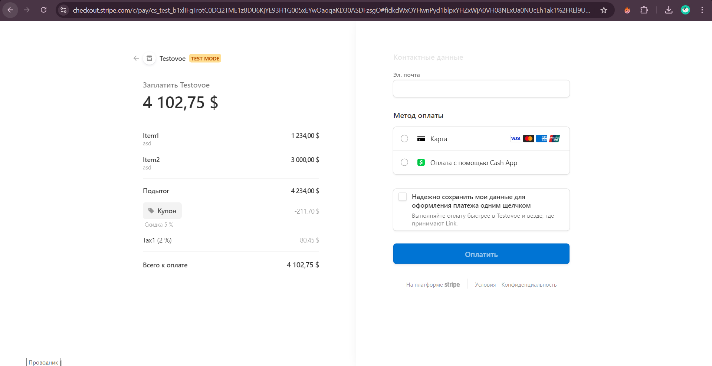
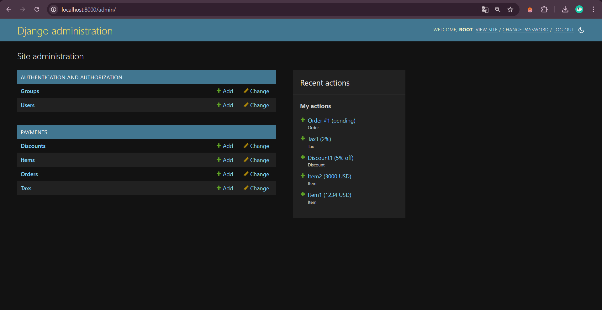

# Django Stripe Payments


- Поддержка заказов с несколькими товарами
- Система скидок и налогов
- Поддержка разных валют (USD, EUR)
- Docker-контейнеризация
- PostgreSQL в качестве базы данных


## Установка

1. Клонируйте репозиторий:

```bash
git clone https://github.com/agapoov/stripe-payment.git
cd stripe-payment
```

2. Создайте и активируйте виртуальное окружение:

```bash
python -m venv venv
venv\Scripts\activate
```

3. Скопируйте файл `.env.example` в `.env` и заполните его:

```bash
cp .env.example .env
```

```bash
docker-compose up --build
```

4. Создайте суперпользователя:

```bash
docker-compose exec web python src/manage.py createsuperuser
```

## Использование

1. Создание товаров:
   - Перейдите в админ-панель Django (/admin)
   - Создайте товары в разделе Items
   - Укажите название, описание, цену и валюту

2. Создание скидок и налогов:
   - В админ-панели создайте скидку в разделе Discounts
   - В админ-панели создайте налог в разделе Taxes

3. Создание заказов:
   - В админ-панели создайте заказ в разделе Orders
   - Добавьте товары в заказ
   - Опционально: добавьте скидку или налог

4. Оплата:
   - Для оплаты отдельного товара: `/item/<id>/`
   - Для оплаты заказа: `/order/<id>/`

## Структура моделей

### Item (Товар)
- name
- description
- price
- currency (USD/EUR)

### Order (Заказ)
- items (связь с товарами)
- discount (скидка)
- tax (налог)
- status (pending/paid/cancelled)
- created_at

### Discount (Скидка)
- name
- percent_off
- stripe_coupon_id (автозаполнение)

### Tax (Налог)
- name
- rate
- stripe_tax_rate_id (автозаполнение)

Все ID-поля Stripe (stripe_coupon_id, stripe_tax_rate_id) заполняются автоматически при первом использовании скидки или налога в заказе.


## Тестирование

Для тестирования оплаты используйте тестовые карты Stripe:
- 4242 4242 4242 4242 (успешная оплата)
- 4000 0000 0000 9995 (недостаточно средств)

## Требования

- Docker и Docker Compose
- Stripe аккаунт (для получения API ключей)


## Скриншоты









